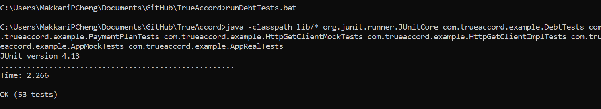

## True Accord Take Home

### Run Instructions
- Please run this with java version 11 or greater. 
- Clone the github repository.
- Go to the command prompt where the repository was downloaded. 
- To run junits execute the *runDebtTests.bat* (Windows) or *runDebtTests.sh* (Unix).

Example:

- To run application execute the *runDebtApp.bat* (Windows) or *runDebtApp.sh* (Unix).  

Example:

Note: org.json.JSONObject does not display attributes with null values. Thus debts with no payment dues date 
do not display the next_payment_due_date.

### Structure
- *src/main* - Contains the main source class files
- *src/test* - Contains the test source class files.
- *mock/* - Contains json files used as mock endpoints for additional mock testing.
- *lib* - Contains required dependency jar files and the trueaccord.jar for the application.
- *runDebtApp.bat*, *runDebtApp.sh * - batch and shell script to execute the debt application
- *runDebtTests.bat*, *runDebtTests.sh * - batch and shell script to execute the junit tests

### Main Classes
- *App* - Main application which processes all debts, associated payments plans if any and their payments, and then outputs the debts with the new fields. The logic to fetch data, parse it and construct associated objects reside here.
- *Debt* - Represents a given customers debt account and how much is owed.  May or may not be associated with a payment plan. This class wraps payment plan if there is one associated and adds a few other business logic use cases to handle when there isn't one associated.  It also contains the logic for "is_in_payment_plan".
- *PaymentPlan* - Represents a payment plan for a given debt account. The majority business logic for remaining amount and next payment due date is here.
- *HttpGetClient* - Interface to fetch various data (i.e. debts, payment plans, payments) from the data store. Two implementations for a real data retrieval and one for mock data for testing.
  
### Description Of Approach
1. Read the document to determine the requirements.  The main requirements identified were the new fields that are being generated for the JSON Line output.
2. Drew picture of how debts and payment plans and payments are related to each other. Realized debt and have zero or one payment plans. Payment plans can have zero to many payments.
3. Write interface and mock fetching real data and mock data to be able to run mock testing.
4. Start writing some pseudo code methods of what I believe I will need to output the results and be able to test them.
5. Start writing junit tests based on inputs and outputs expected that would test those API and have the tests fail as they aren't implemented yet.
6. Start implementing code to make tests pass. As working through code, constantly identify new functions required and refactor code and add new tests as appropriate.
7. Once tests are passing, try to think of other unhappy or corner cases to test and write those tests to fail and then implement code to make them pass.
8. Once the application is logically implemented correctly and tested thoroughly with mock data, test with the real backend data for end to end testing.
9. Write junit tests to validate the results for the actual data and compute by hand what the real results are supposed to return.
10. Once everything is passing and confident in results, jar the class files and write scripts to execute the junits and application.

### Assumptions Made
1. I wasn't clear on page 2 where it said _"Output the value as a JSON number."_ When I converted the attribute to javax.json.JsonNumber the attribute would print out as a string. So I assumed this wasn't what was wanted and just output BigDecimal instead so it would parse back to a number when being read back in..  
2. I wasn't clear if the first payment starts for the very first start day of the payment plan or its due after the first installment period.  I assumed the later, because I assume we would give customers leeway and time to make their first payment.
3. Since we're dealing with money I used BigDecimal for accuracy.
4. There were payments made and balances in fractions of cents. I assumed this is allowed and we would maintain the balances and computations in fractions of cents rather than rounding to the nearest hundredth.
5. I put an assumption that there wouldn't be more than 10000 installments for a payment plan to avoid putting an infinite loop.

### What Would Be Done Differently With More Time
- Write javadocs for private methods. 
- Write code to be defensive for any type of bad inputs.  I tried to catch some bad inputs where they were obvious, but there is always more that could be done.
- Write code to process the data as a stream rather than load all into memory at once, for larger scale application.
- Write more tests to handle more unexpected corner cases.
- Perhaps find a different json api to use that would output an attribute despite it being null. Or just write my own toJSONLine() method that will output the json object the format desired.
- Write algorithms and code to be more efficient (i.e. remove any possible duplicate work or finding what caching can be done) for performance and scalability.
